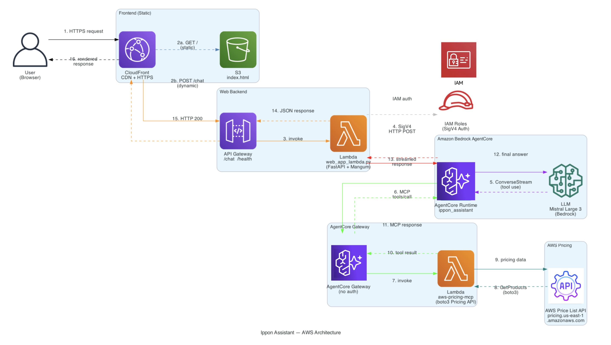
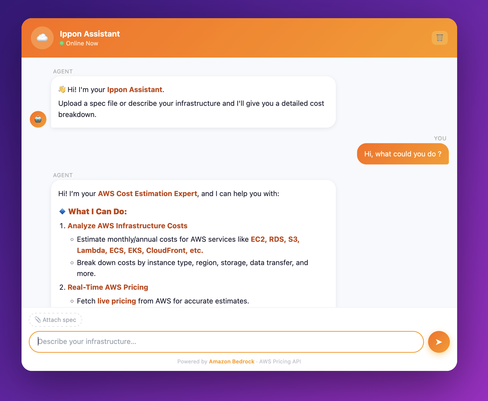
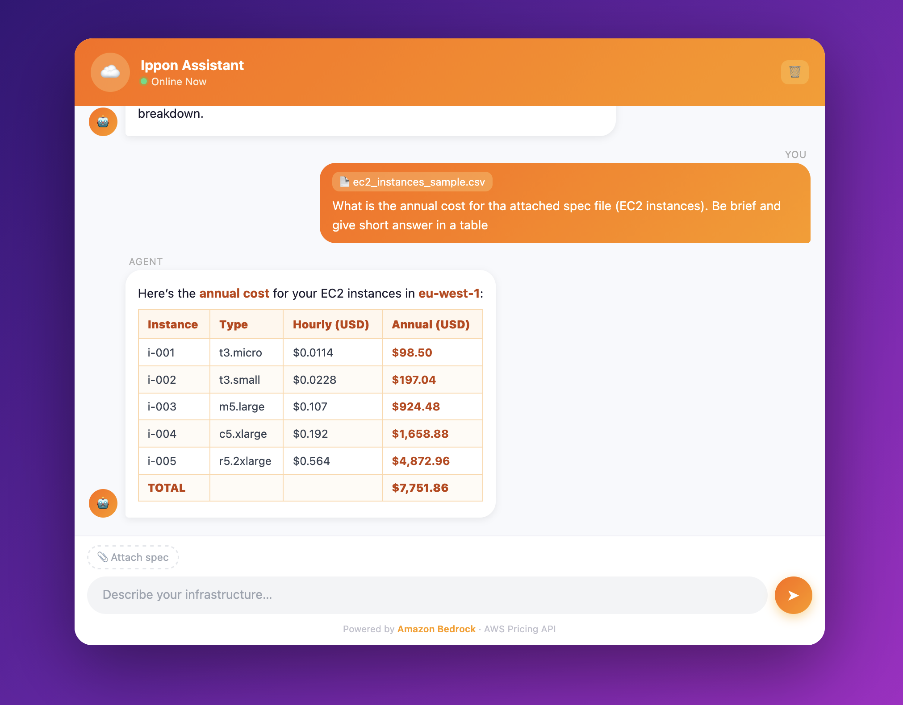

# Ippon Assistant — AWS Cost Estimator

Un agent IA conversationnel qui analyse des spécifications d'infrastructure et produit des estimations de coûts AWS en temps réel, en s'appuyant sur l'AWS Pricing API.

---

## Table des matières

1. [Vue d'ensemble](#vue-densemble)
2. [Stack technique](#stack-technique)
3. [Architecture AWS](#architecture-aws)
4. [Structure du projet](#structure-du-projet)
5. [Prérequis](#prérequis)
6. [Tests en local](#tests-en-local)
7. [Déploiement AgentCore](#déploiement-agentcore)
8. [Déploiement de l'infra web (CDK)](#déploiement-de-linfra-web-cdk)
9. [Configuration](#configuration)
10. [Référence des endpoints](#référence-des-endpoints)

---

## Vue d'ensemble

L'application expose un chatbot web qui permet à un utilisateur de :

- Décrire son infrastructure en langage naturel
- Uploader un fichier de spec (YAML, JSON, CSV, TXT)
- Recevoir un tableau de coûts détaillé (mensuel / annuel) avec des conseils d'optimisation

L'agent utilise le modèle **Mistral Large 3** via Amazon Bedrock et interroge l'**AWS Pricing API** via un outil MCP (Model Context Protocol) pour obtenir des prix en temps réel.

Deux modes d'exécution coexistent :

| Mode | Description |
|------|-------------|
| **Local** | Agent Strands exécuté directement sur la machine, MCP via stdio (`uvx`) ou Gateway HTTP |
| **AgentCore** | Agent déployé sur Amazon Bedrock AgentCore Runtime, invoqué via API signée SigV4 |

---

## Stack technique

| Couche | Technologie |
|--------|-------------|
| Agent framework | [Strands Agents SDK](https://github.com/strands-agents/sdk-python) |
| Modèle LLM | `mistral.mistral-large-3-675b-instruct` via Amazon Bedrock |
| Outil MCP | AWS Pricing Lambda exposé via AgentCore Gateway |
| Runtime agent (prod) | Amazon Bedrock AgentCore Runtime |
| Web server (local) | FastAPI + Uvicorn, streaming SSE |
| Web server (Lambda) | FastAPI + Mangum (ASGI adapter) |
| Frontend | HTML/CSS/JS vanilla, Marked.js pour le rendu Markdown |
| Infra agent | AWS CDK v2 (`@aws/agentcore-cdk`) |
| Infra web | AWS CDK v2 (Lambda + API Gateway + CloudFront + S3) |
| Packaging Python | `uv` / `hatchling` |
| Runtime Python | 3.13 (AgentCore), 3.12 (Lambda web) |

---

## Architecture AWS



```
┌─────────────────────────────────────────────────────────────────┐
│                         Utilisateur                             │
└───────────────────────────┬─────────────────────────────────────┘
                            │ HTTPS
                            ▼
                   ┌─────────────────┐
                   │   CloudFront    │
                   └────┬───────┬────┘
                        │       │ /static/*
                        │       ▼
                        │   ┌───────┐
                        │   │  S3   │  (assets statiques)
                        │   └───────┘
                        │ /*
                        ▼
               ┌─────────────────────┐
               │    API Gateway      │
               │  (ippon-assistant)  │
               └──────────┬──────────┘
                          │
                          ▼
               ┌─────────────────────┐
               │  Lambda (FastAPI)   │
               │  web_app_lambda.py  │
               └──────────┬──────────┘
                          │ SigV4 / bedrock-agentcore:InvokeRuntime
                          ▼
          ┌───────────────────────────────────┐
          │  Bedrock AgentCore Runtime        │
          │  IpponAWSAssistant_ippon_assistant │
          │  (main.py — Strands Agent)        │
          └──────────────┬────────────────────┘
                         │ HTTP MCP (Streamable HTTP)
                         ▼
          ┌───────────────────────────────────┐
          │  AgentCore Gateway (MCP)          │
          │  gateway-pricing-test-*           │
          └──────────────┬────────────────────┘
                         │ Invoke
                         ▼
          ┌───────────────────────────────────┐
          │  Lambda Pricing                   │
          │  (AWS Pricing API)                │
          │  Tools: get_pricing               │
          │         list_services             │
          │         get_attribute_values      │
          └───────────────────────────────────┘
```

### Composants clés

**AgentCore Runtime** — héberge l'agent Strands. Reçoit un `prompt` JSON, stream la réponse en HTTP chunked. Déployé via `agentcore deploy` (CDK sous le capot).

**AgentCore Gateway** — proxy MCP qui expose la Lambda Pricing comme un outil MCP accessible en HTTP sans auth depuis le runtime. Configuré dans `agentcore.json`.

**Lambda Pricing** — implémente le protocole JSON-RPC MCP. Appelle `boto3.client("pricing")` pour récupérer les prix on-demand en temps réel.

**Lambda Web (FastAPI + Mangum)** — reçoit les requêtes HTTP de l'utilisateur, construit le prompt (texte + fichier éventuel), appelle le runtime AgentCore en SigV4, retourne la réponse JSON.

**CloudFront** — point d'entrée unique. Route `/static/*` vers S3, tout le reste vers API Gateway.

---

## Demo chatbot pricing






## Structure du projet

```
bedrock-agentcore-migrations/
├── agentcore/                  # Configuration AgentCore (source de vérité)
│   ├── agentcore.json          # Spec du projet (runtime, env vars, gateway)
│   ├── aws-targets.json        # Cibles de déploiement (account, region)
│   ├── .env.local              # Variables locales (gitignored)
│   ├── .llm-context/           # Types TypeScript pour validation de schema
│   └── cdk/                    # CDK AgentCore (généré, ne pas éditer)
│       └── lib/cdk-stack.ts    # Stack AgentCoreApplication + AgentCoreMcp
│
├── app/
│   └── ippon_assistant/
│       ├── main.py             # Entrypoint AgentCore Runtime (BedrockAgentCoreApp)
│       ├── agent.py            # Création de l'agent Strands (modèle + MCP)
│       ├── web_app.py          # Serveur FastAPI local (SSE streaming)
│       ├── web_app_lambda.py   # Serveur FastAPI Lambda (JSON, Mangum)
│       ├── build_lambda.sh     # Script de packaging du zip Lambda
│       ├── requirements_lambda.txt
│       ├── pyproject.toml
│       ├── model/load.py       # Chargement du modèle Bedrock
│       ├── mcp_client/client.py # Client MCP (Gateway HTTP ou stdio local)
│       └── static/index.html   # Frontend chatbot
│
├── infra/
│   └── cdk/
│       └── lib/stack.ts        # Stack web (Lambda + API GW + CloudFront + S3)
│
└── lambda/
    └── pricing/
        ├── lambda_function.py  # Lambda MCP Pricing (JSON-RPC)
        └── gateway_target.json # Déclaration des outils MCP pour le Gateway
```

---

## Prérequis

- **Node.js** 20.x ou supérieur
- **Python** 3.10+
- **uv** — gestionnaire de packages Python ([installation](https://docs.astral.sh/uv/getting-started/installation/))
- **AWS CLI** configuré avec un profil valide (`aws configure`)
- **AgentCore CLI** installé (`npm install -g @aws/agentcore-cli` ou équivalent)
- Accès au modèle `mistral.mistral-large-3-675b-instruct` activé dans Amazon Bedrock (région `us-east-1`)

---

## Tests en local

### 1. Installer les dépendances Python

```bash
cd bedrock-agentcore-migrations/app/ippon_assistant
uv sync
```

### 2. Lancer le serveur web local (mode agent local)

Par défaut, l'agent tourne localement avec Strands et se connecte au Gateway MCP via HTTP.

```bash
cd bedrock-agentcore-migrations/app/ippon_assistant
uv run python -m uvicorn web_app:app --reload --port 8080
```

Ouvrir [http://localhost:8080](http://localhost:8080) dans le navigateur.

### 3. Lancer en mode AgentCore (runtime déployé sur AWS)

Passer la variable d'environnement `USE_AGENTCORE=true` pour que le serveur local appelle le runtime déployé au lieu de l'agent local.

```bash
cd bedrock-agentcore-migrations/app/ippon_assistant
USE_AGENTCORE=true uv run python -m uvicorn web_app:app --reload --port 8080
```

Vérifier le mode actif :

```bash
curl http://localhost:8080/mode
# {"mode":"agentcore","runtime_url":"https://..."}
```

### 4. Tester l'agent directement (sans UI)

```bash
cd bedrock-agentcore-migrations/app/ippon_assistant
uv run python -c "
import asyncio
from agent import get_or_create_agent

async def main():
    agent = get_or_create_agent()
    async for event in agent.stream_async('Combien coûte une instance EC2 t3.medium en us-east-1 ?'):
        if 'data' in event:
            print(event['data'], end='', flush=True)

asyncio.run(main())
"
```

### 5. Tester via AgentCore CLI

```bash
cd bedrock-agentcore-migrations
agentcore invoke --prompt "Estime le coût d'un cluster ECS avec 3 instances t3.large"
```

### 6. MCP client en mode stdio (sans Gateway)

Si le Gateway n'est pas déployé, le client MCP bascule automatiquement sur `uvx` en local. S'assurer que `uvx` est installé et que les credentials AWS sont configurés.

```bash
# Vérifier que uvx fonctionne
uvx awslabs.aws-pricing-mcp-server@latest --help
```

---

## Déploiement AgentCore

Le déploiement de l'agent sur Amazon Bedrock AgentCore Runtime se fait via la CLI AgentCore, qui orchestre CDK en arrière-plan.

### Déployer

```bash
cd bedrock-agentcore-migrations
agentcore deploy
```

Cette commande :
1. Package le code de `app/ippon_assistant/` en zip (build `CodeZip`)
2. Synthétise et déploie la stack CDK `AgentCore-IpponAWSAssistant-default`
3. Crée / met à jour le runtime AgentCore et le Gateway MCP

### Vérifier le statut

```bash
agentcore status
```

### Invoquer le runtime déployé

```bash
agentcore invoke --prompt "Liste les services AWS disponibles dans l'API Pricing"
```

### Déployer via CDK directement

```bash
cd bedrock-agentcore-migrations/agentcore/cdk
npm install
npx cdk synth   # Prévisualiser le template CloudFormation
npx cdk deploy  # Déployer
```

### Modifier la configuration de l'agent

Éditer `agentcore/agentcore.json` (source de vérité). Ne jamais modifier `agentcore/cdk/` directement.

```json
{
  "runtimes": [{
    "name": "ippon_assistant",
    "envVars": [
      { "name": "GATEWAY_MCP_URL", "value": "https://..." },
      { "name": "AWS_REGION",      "value": "us-east-1"  }
    ]
  }]
}
```

Valider avant de déployer :

```bash
agentcore validate
```

> **Important** : renommer le champ `name` d'un runtime détruit et recrée la ressource. Modifier les autres champs met à jour en place.

---

## Déploiement de l'infra web (CDK)

La stack `IpponAssistantStack` déploie le frontend web (Lambda + API Gateway + CloudFront + S3).

### 1. Builder le package Lambda

```bash
cd bedrock-agentcore-migrations/app/ippon_assistant
bash build_lambda.sh
```

Cela crée `lambda_package/` avec toutes les dépendances et le code applicatif.

### 2. Déployer la stack CDK

```bash
cd bedrock-agentcore-migrations/infra/cdk
npm install
npx cdk deploy
```

### Outputs CDK

| Output | Description |
|--------|-------------|
| `CloudFrontURL` | URL publique de l'application |
| `ApiGatewayURL` | URL directe de l'API Gateway |

### Ce que la stack crée

| Ressource | Détail |
|-----------|--------|
| S3 Bucket | Assets statiques (index.html), accès privé via OAC |
| Lambda `ippon-assistant-web` | Python 3.12, handler `web_app_lambda.handler`, 512 MB, timeout 120s |
| API Gateway `ippon-assistant-api` | Proxy Lambda, CORS activé, stage `prod` |
| CloudFront Distribution | HTTPS, `/static/*` → S3, `/*` → API Gateway |
| IAM Policy | Lambda autorisée à appeler `bedrock-agentcore:InvokeAgentRuntime` |

---

## Configuration

### Variables d'environnement

| Variable | Valeur par défaut | Description |
|----------|-------------------|-------------|
| `USE_AGENTCORE` | `false` | `true` pour appeler le runtime AWS au lieu de l'agent local |
| `GATEWAY_MCP_URL` | URL du Gateway déployé | URL du Gateway MCP AgentCore |
| `AWS_REGION` | `us-east-1` | Région AWS |
| `AWS_PROFILE` | `default` | Profil AWS CLI (mode local stdio uniquement) |
| `AGENTCORE_RUNTIME_URL` | ARN encodé du runtime | URL d'invocation du runtime (Lambda web) |

### Fichiers de configuration

| Fichier | Rôle |
|---------|------|
| `agentcore/agentcore.json` | Spec du projet AgentCore (runtimes, memories, credentials) |
| `agentcore/aws-targets.json` | Cibles de déploiement (account ID, region) |
| `agentcore/.env.local` | Variables locales sensibles (gitignored) |
| `lambda/pricing/gateway_target.json` | Déclaration des outils MCP exposés par le Gateway |

---

## Référence des endpoints

### Web App (local & Lambda)

| Méthode | Path | Description |
|---------|------|-------------|
| `GET` | `/` | Interface chatbot (HTML) |
| `POST` | `/chat` | Envoyer un message (form-data: `message`, `spec_file` optionnel) |
| `GET` | `/mode` | Mode actif (`local` ou `agentcore`) |
| `GET` | `/health` | Health check (Lambda uniquement) |

### Lambda Pricing (MCP JSON-RPC)

| Outil MCP | Description |
|-----------|-------------|
| `list_services` | Liste tous les services AWS disponibles dans l'API Pricing |
| `get_attribute_values` | Valeurs valides d'un attribut pour un service (ex: `instanceType` pour `AmazonEC2`) |
| `get_pricing` | Prix on-demand pour un service avec filtres `TERM_MATCH` |

---

## Commandes AgentCore CLI

| Commande | Description |
|----------|-------------|
| `agentcore dev` | Lancer l'agent en mode développement local |
| `agentcore deploy` | Déployer sur AWS |
| `agentcore status` | Statut du déploiement |
| `agentcore invoke` | Invoquer l'agent (local ou déployé) |
| `agentcore validate` | Valider la configuration JSON |
| `agentcore package` | Packager les artefacts |
| `agentcore add` | Ajouter une ressource (agent, memory, credential, target) |
| `agentcore remove` | Supprimer une ressource |
| `agentcore update` | Vérifier les mises à jour de la CLI |
